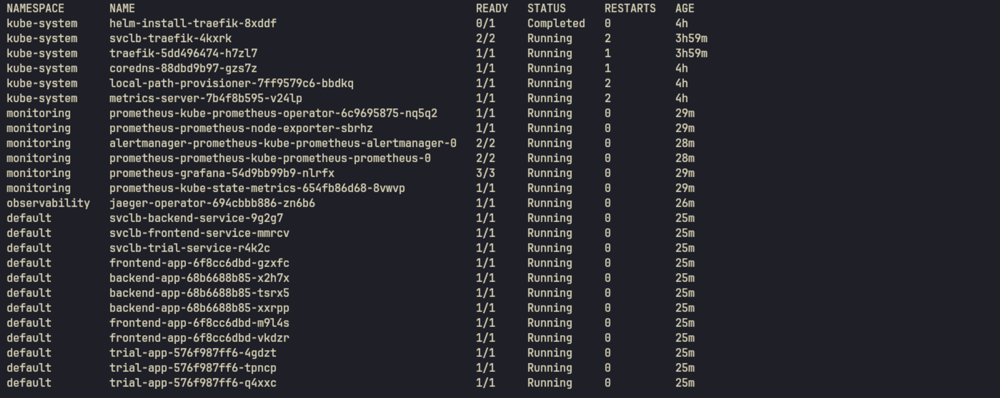
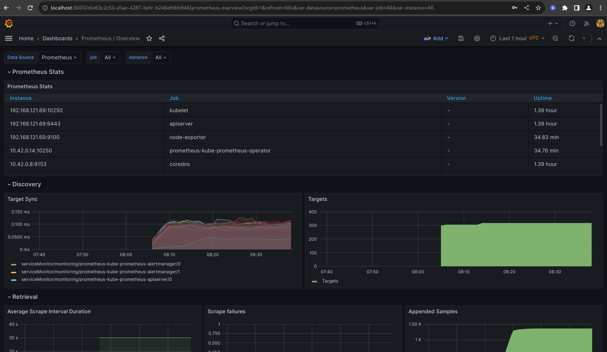
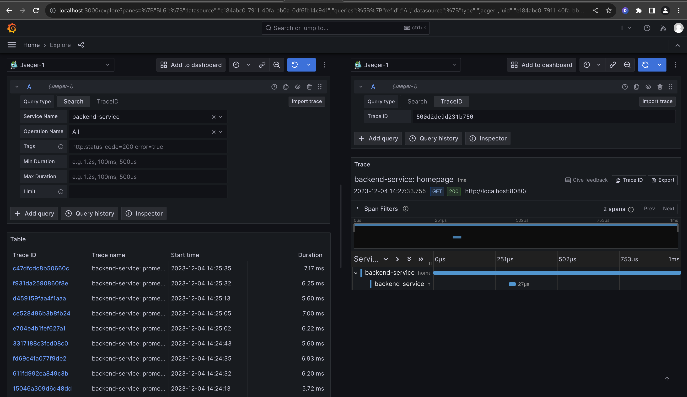
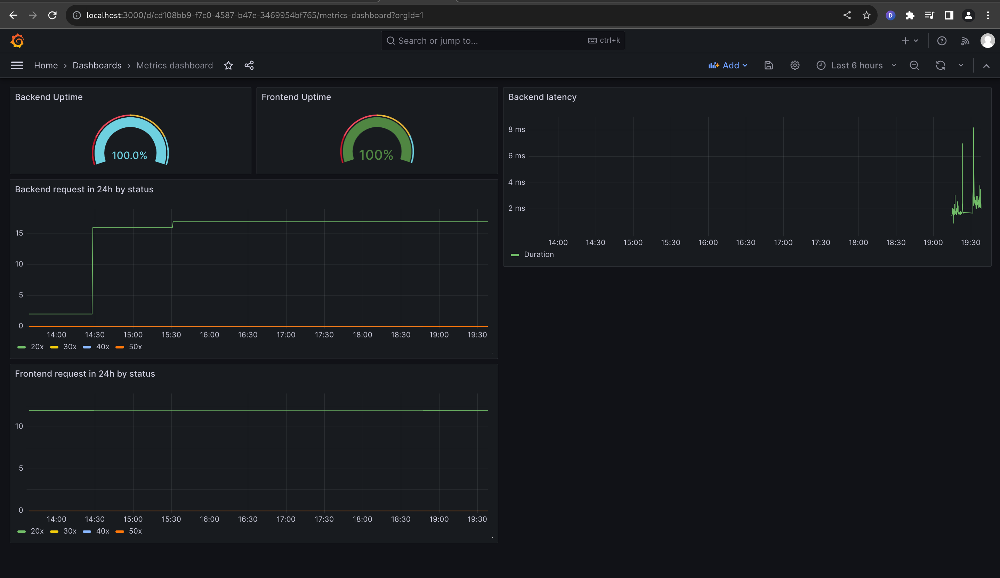
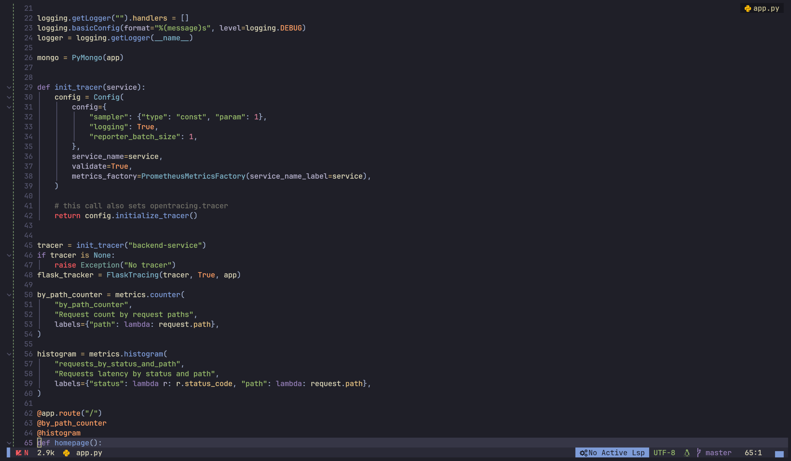
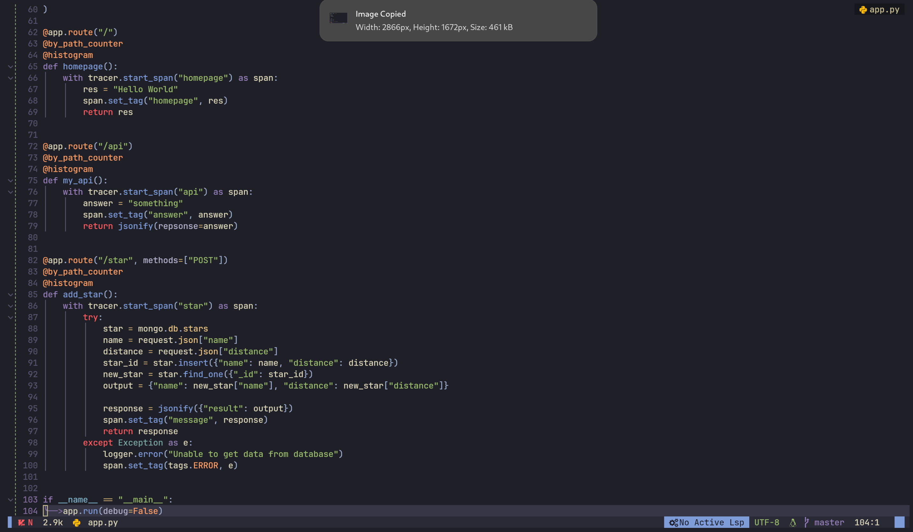
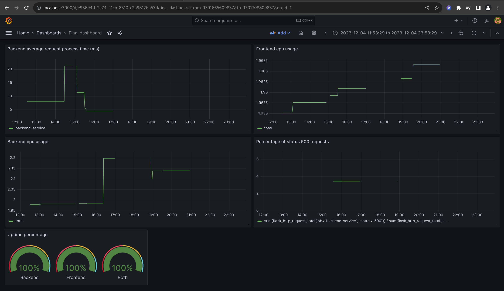

## Verify the monitoring installation

run `kubectl` command to show the running pods and services for all components. Take a screenshot of the output and include it here to verify the installation

## Setup the Jaeger and Prometheus source
Expose Grafana to the internet and then setup Prometheus as a data source. Provide a screenshot of the home page after logging into Grafana.
 
 

## Create a Basic Dashboard
Create a dashboard in Grafana that shows Prometheus as a source. Take a screenshot and include it here.

## Describe SLO/SLI
- SLO: Service level objective - SLOs are what set customer expectations and tell IT and DevOps teams what goals they need to hit and measure themselves against.
- SLI: Service level indicator - Actual measurement of the goals set in SLO

## Creating SLI metrics.
- Uptime
- Latency
- CPU/Memory usage
- Failure rate
- Number of success/failed requests

## Create a Dashboard to measure our SLIs

## Tracing our Flask App
*TODO:*  We will create a Jaeger span to measure the processes on the backend. Once you fill in the span, provide a screenshot of it here. Also provide a (screenshot) sample Python file containing a trace and span code used to perform Jaeger traces on the backend service.

## Jaeger in Dashboards

## Report Error
TROUBLE TICKET

Name: 500 Internal Server Error

Date: Dec 04th, 2023

Subject: Internal server error when sending POST request to /star endpoint

Affected Area: /star endpoint

Severity: HIGH

Description: The mongo database client wasn't initialized properly.

## Creating SLIs and SLOs
- Application uptime of 99.99% per month
- CPU/Memory load average in a month should be less than 80%
- Average request process time in a month should be less than 20ms
- Average request process time in a month should be less than 20ms
- More than 99% request are not 500

## Building KPIs for our plan
- Application uptime of 99.95% per month
    - Average and individual uptime percentage should be 99.5% or more
    - It will give us an overview of service availability and stability
- CPU/Memory load average in a month should be less than 80%
    - If cpu usage is more than 80% then it's time we need to think about
    performance optimization or a scaling strategy
- Average request process time in a month should be less than 20ms
    - Average request time will give us backend a brief look at user experience
    - Request time more than 20ms means that we need to narrow down the low performance
    endpoint and think about improving it
- More than 99% request are not 500
    - Means that there's no critical issue in the code base
    - If 500 errors happen frequently, we can know which service is causing the issue
    and fix it- Application uptime of 99.99% per month

## Final Dashboard

